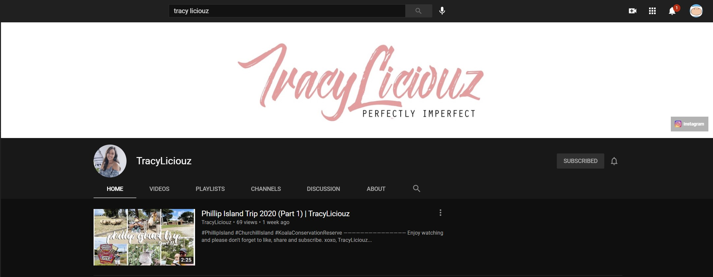

# Data Analytics with Python Course - Final Assessment
## Data Collection and Cleaning
submitted by: Ramon (Monch) Mercader

submitted to: Ramon Perez / Coder Academy - ramon.perez@coderacademy.edu.au

README.md File

Project folder contents
    - Collect_and_Clean.ipynb (File 1 of 2) 
    - Analyzing.ipynb (File 2 of 2) 
    - README.md 
    - datasets (empty folder for collected datasets) 
    - images (folder containing images for notebooks) 
    - Youtube_scraper (folder containing youtube data collection script, credits in README.md) 
    
### Project Background

 

Tracylizious Youtube Link - <a href="https://www.youtube.com/channel/UCWvdQQKH9LslKy2ZWnQDHLQ">http://www.youtube.com/channel/UCWvdQQKH9LslKy2ZWnQDHLQ<a/>
    
A friend of mine runs a Youtube channel, she creates content about fashion, travel, food, and hospitality. We both knew that there's a lot of similar content out there, so we were thinking that maybe a quick look into some trending youtube videos could provide some ideas on how she could improve her own. And possibly either put her focus into content that's not so common or show her which styles work.  So the main goal of this assessment is to look into trending Youtube video data and see if there are any patterns or similarities across them. 

### Context

Understanding that there are other platforms out there that can do this but are paid
The main objective of this is to get a snapshot and practice my skills in collecting data, cleaning, managing, and reviewing
This is not an exhaustive project, it only focuses on the top trending videos for a certain timeframe. 

The focus of this proj

### Objectives

Based on some research, Youtube have daily

### Parameters

I did a bit of research and found that Youtube did release a 2020 Top Trending Videos for the U.S. which can be found here:
https://blog.youtube/culture-and-trends/2020-top-trending-youtube-videos-creators

[https://blog.youtube/culture-and-trends/2020-top-trending-youtube-videos-creators]

Other references based on the Youtube Blog - https://www.thrillist.com/entertainment/i-binge-watched-discovery-for-48-hours-straight

The data that we're trying to gather is similar, but we wanted to get an in-depth look into this and also into other countries, not just the U.S. 

The focus of this project will be around the top trending videos from DATE to DATE in the following countries:
    - United States of America (US)
    - Australia (AU)
    - United Kingdom (GB)
    - Singapore (SG)
    - New Zealand (NZ)
    - Philippines (PH)

We focused the following countries because this was her identified target audiences. 
    
### Considerations

We did not focus on the video length, 

    
### Steps
1. Collect the data from the following countries
    - The datasets should have the following: 
        - Youtube video ID
        - Youtube video URL
        - Trending date
        - Video title
        - Channel title
        - Category ID
        - Publish time (upload date)
        - Tags
        - Number of views
        - Youtube video link
        - Number of likes
        - Number of dislikes
        - Number of comments
        - Number of shares

2. Clean the Data
    - Tasks to clean the data:
        - Check to see if the data is in the correct format, look at the header and tail ends and review data
        - Fill in any missing values with N/A
        - Remove duplicates
        - Convert categorical data into numerical values
        - Check to see if values within a category are in the same scale

3. Manipulate the data and answer the top 5 questions
   - What are the trending videos per country
   
4. Visualize the data based on:
   - Top trending videos per country (static)
   - Top trending categories per country (static)
   - How many likes and dislikes does each video have vs views (static)
    

